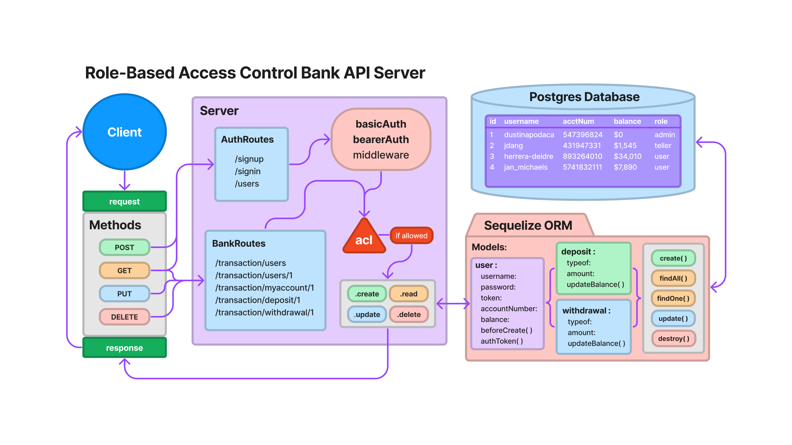

# Project: REST Bank Auth-API Server with TDD

### Author: Dustin Apodaca & Jacob Dang

### Problem Domain

- Build a REST Auth-API using Express, by creating a proper series of endpoints that perform CRUD operations on a database, including server modularization, use of middleware, a model interface, and tests using the REST standard. Implement Role-Based Access Control (RBAC) using an Access Control List (ACL), allowing restricted access to routes for valid users based on the individual permissions we give each user on account creation.

### Links and Resources

- [CI/CD](https://github.com/dustinapodaca/bank-auth-api/actions) (GitHub Actions)
<!-- - [Prod Deployment]()
- [Dev Deployment]() -->

### Setup

#### `.env` requirements (where applicable)

see `.env.sample`

- `PORT` - 3001

#### How to initialize/run your application (where applicable)

- nodemon

#### Features / Routes

- Feature 1: BasicAuth Middleware
- Feature 2: BearerAuth Middleware
- Feature 3: ACL Middleware
- Feature 4: Auth-API Server
  - `/signup` - POST
  - `/signin` - POST - Basic Auth
  - `/users` - GET - Bearer Auth & ACL
  - `/users/:id` - GET - Bearer Auth & ACL
- Feature 5 : RBAC - ACL
  - Bank routes `/transactions` for `/users`, `/deposit`, and `/withdrawal`
  - `/:model` - GET - Bearer Auth & ACL
  - `/:model/:id` - GET - Bearer Auth & ACL
  - `/:model/myaccount/:id` - GET - Bearer Auth & ACL
  - `/:model:id` - PUT - Bearer Auth & ACL
  - `/:model:id` - DELETE - Bearer Auth & ACL

#### Tests

- How do you run tests?
  - `npm test`
- AuthRoutes.test.js
  - allow POST `/signup` a testUser - 201
  - allow POST `/signup` a testTeller - 201
  - allow POST `/signup` a testAdmin - 201
  - allow POST `/signin` a testUser - 200
  - allow POST `/signin` a testTeller - 200
  - allow POST `/signin` a testAdmin - 200
  - deny GET `Access Denied` - to GET all users with only basicAuth - 403
  - deny GET `Access Denied` - to GET all users without update permissions - 403
  - allow GET `/users` - to GET all users with teller (update) permissions - 200
  - allow GET `/users` - to GET all users with admin (update, delete) permissions - 200
  - allow GET `/users/1` - to GET one user by id with teller and admin permissions - 200

- BankRoutes.test.js - `('/transaction/:model')`
  - allow teller access PUT `/transaction/deposit` - to PUT a deposit in any user account and update user balance - 200
  - allow teller access PUT `/transaction/withdrawal` - to PUT a withdrawal in any user account and update user balance - 200
  - allow admin access PUT `/transaction/deposit` - to PUT a deposit in any user account and update user balance - 200
  - allow admin access PUT `/transaction/withdrawal` - to PUT a withdrawal in any user account and update user balance - 200
  - deny user access PUT `/transaction/deposit` - to PUT a deposit in user account - 403
  - deny user access PUT `/transaction/withdrawal` - to PUT a withdrawal in user account - 403
  - return 422 error PUT `/transaction/withdrawal` - if the user has insufficient funds to process the transaction - 422
  - deny user access GET `/transaction/users` - to GET all user accounts - 403
  - deny user access GET `/transaction/myaccount/users/2` - to GET a different user account - 403
  - allow user access GET `/transaction/myaccount/users/1` - to GET their own user account - 200
  - allow teller and admin access GET `/transaction/users` - to GET all user accounts - 200
  - allow teller and admin access GET `/transaction/users/1` - to GET a different user account by id - 200
  - deny user and teller access DELETE `/transaction/users/1` - to DELETE a user account - 500
  - allow admin access DELETE `/transaction/users/1` - to DELETE a user account - 204

#### UML

Link to an image of the UML for your application and response to events:

