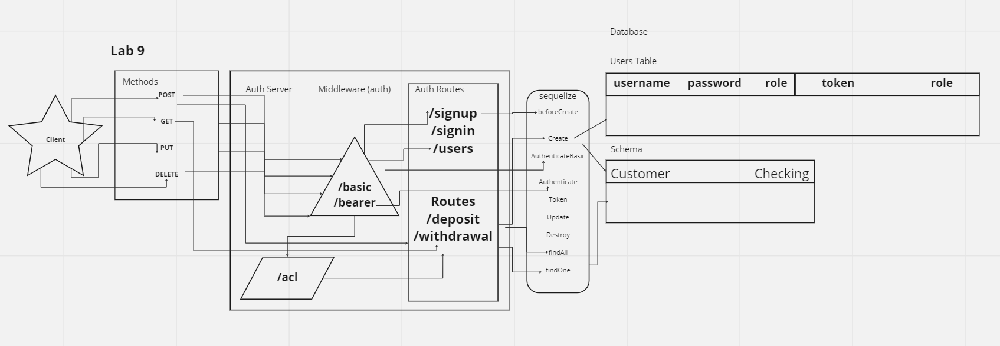

# Project: REST Bank Auth-API Server with TDD

### Author: Dustin Apodaca & Jacob Dang

### Problem Domain

- Build a REST Auth-API using Express, by creating a proper series of endpoints that perform CRUD operations on a database, including server modularization, use of middleware, a model interface, and tests using the REST standard. Implement Role-Based Access Control (RBAC) using an Access Control List (ACL), allowing not only restricted access to routes for valid users, but also based on the individual permissions we give each user.

### Links and Resources

- [CI/CD](https://github.com/dustinapodaca/bank-auth-api/actions) (GitHub Actions)
<!-- - [Prod Deployment]()
- [Dev Deployment]() -->

### Setup

#### `.env` requirements (where applicable)

see `.env.sample`

- `PORT` - 3001

#### How to initialize/run your application (where applicable)

- nodemon

#### Features / Routes

- Feature 1: BasicAuth Middleware
- Feature 2: BearerAuth Middleware
- Feature 3: ACL Middleware
- Feature 4: Auth-API Server
  - `/signup` - POST
  - `/signin` - POST - Basic Auth
  - `/users` - GET - Bearer Auth
- Feature 5 : RBAC - ACL
  - Bank routes `/transactions` for `/users`, `/deposit`, and `/withdrawawl`
  - `/:model/:id` - GET - Bearer Auth & ACL
  - `/:model` - GET - Bearer Auth & ACL
  - `/:model:id` - PUT - Bearer Auth & ACL
  - `/:model:id` - DELETE - Bearer Auth & ACL

#### Tests

- How do you run tests?
  - `npm test`
- AuthRoutes.test.js
  - POST `/signup` - 201
  - POST `/signin` - 200
  - GET `/users` - 200 or 403 (if not admin or teller)
- BankRoutes.test.js - `('/transaction/:model')`
  - GET `/users/:id` - 200 (for user)
  - GET `/users/:id` - 403 (for non-user)
  - GET `/users` - 200 or 403 (if not admin or teller)
  - PUT `/deposit/:id` - 200 or 403 (if not admin or teller)
  - PUT `/withdrawal/:id` - 200 or 403 (if not admin or teller)
  - PUT `/users/:id` - 200 or 403 (if not admin or teller)
  - DELETE `/:model/:id` - 200 or 403 (if not admin or teller)

#### UML

Link to an image of the UML for your application and response to events

